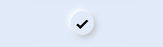

# Neumorphism_Checkbox

# Installation :

Install using npm inside pages directory

```npm init -y```

```npm i hmos-neumorphism ```

# Note :

Add this css snippet when passing input or button through slot .

```css
button, input{
    width: 100%;
    height: 100%;
    background-color:transparent;
    text-color: black;
}
```

# Checkbox



Import:
```html
<element name='neucheckbox' src='../node_modules/hmos-neumorphism/checkbox/checkbox.hml'></element>
```

Usage:
```html
<neucheckbox color="" width="50px" height="50px" border="50px" checked="true" @check-event="checkboxClick"></neucheckbox>
```

# Radio


Import:
```html
<element name='neuradio' src='../node_modules/hmos-neumorphism/radio/radio.hml'></element>
```

Usage:
```html
<neuradio width="50px" color="" height="50px" border="50px" checked="" @check-event="radioClick"></neuradio>
```

# Switcher


Import:
```html
<element name='neuswitcher' src='../node_modules/hmos-neumorphism/switcher/switcher.hml'></element>
```

Usage:
```html
<neuswitcher width="60px" color="" height="30px" border="50px" toggle="off" @toggle-event="toggleClick"></neuswitcher>
```

# Reference:

<a href="https://neumorphism.io/">neumorphism.io</a>

<a href="https://ismail9k.github.io/neomorphism/">ismail9k.github.io/neomorphism</a>
